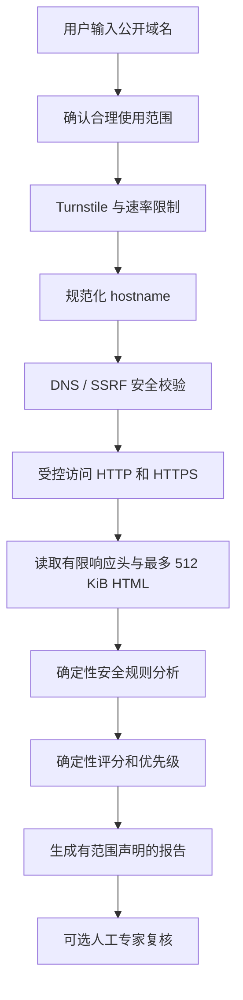

# ShipAudit 功能与安全学习说明书

版本：1.0  
日期：2026-07-12  
适用读者：具有长期 IT 和 Identity and Access Management（IAM）经验，但对 Web 浏览器安全、HTTP 安全配置、前端暴露与公开网站扫描不熟悉的安全从业者  
对应主规格：`docs/website-security-checkup-master-spec.md` v1.1

---

## 1. 这份说明书解决什么问题

ShipAudit 的目标不是教人“怎样入侵网站”，也不是把一个域名扫描成“安全”或“不安全”两个结论。

它解决的是一个更窄、更实际的问题：

> 一个使用 Lovable、Bolt、Replit、Cursor、Vercel、Supabase、Firebase 等工具快速构建的公开 Web 应用，在上线前是否存在可以从外部观察到的常见 HTTP、浏览器、Cookie 和前端配置问题？这些问题中，哪些应该先修？

对于 IAM 专家，可以先把 ShipAudit 理解为：

- IAM 关注“谁可以访问什么，以及怎样证明这个人是谁”。
- ShipAudit 关注“浏览器与网站怎样建立连接、网站给浏览器下达了哪些安全约束，以及公开前端是否暴露了不该暴露的内容”。
- 两者都属于安全控制，但作用在不同层面。

ShipAudit 不取代 IAM。一个网站可能具有非常完善的 SSO、MFA、RBAC 和生命周期管理，同时仍然缺少 HSTS、CSP 或安全 Cookie 属性；反过来，一个网站的 HTTP 安全头全部配置正确，也不代表它的权限模型、管理员角色或数据访问控制是正确的。

---

## 2. 当前状态：已经完成什么，还没有完成什么

理解 ShipAudit 时，必须区分“产品规划”和“当前已经运行的功能”。

### 2.1 截至 2026-07-12 已经完成

当前仓库处于 Phase -1 / Phase 0，已经具备：

- ShipAudit 英文产品首页。
- 一份使用示例数据的安全报告页面。
- 方法论和范围说明页面。
- `$99` Founding Expert Review 的申请表单。
- Astro + React + Tailwind 前端工程骨架。
- Cloudflare Worker + Hono 后端工程骨架。
- `/api/health` 健康检查接口。
- 前后端共享的 TypeScript contracts 包。
- Worker 基础测试、类型检查和构建流程。

### 2.2 当前尚未完成

当前系统还没有：

- 自动扫描引擎。
- DNS、SSRF 和安全重定向实现。
- HTTP header、Cookie、CSP 或 HTML 自动评分。
- 自动生成的真实报告。
- D1 报告存储。
- Turnstile 和生产速率限制。
- Creem 或 Stripe 实际付款链路。
- Cloudflare 正式部署。
- Chrome 扩展。
- 持续监控、徽章或 AI 摘要。

因此，当前网站应被理解为产品验证站和人工服务入口，而不是已经上线的自动安全扫描器。

Phase -1 的人工复核可以使用公开工具、确定性检查清单和人工判断完成，但不能对客户暗示 ShipAudit 自有自动扫描器已经投入运行。

---

## 3. 从 IAM 视角理解 ShipAudit 所在的安全层

下面的映射有助于把熟悉的 IAM 概念连接到 ShipAudit 检查的 Web 安全概念。

| IAM 中熟悉的对象 | Web/ShipAudit 中相近的对象 | 主要区别 |
|---|---|---|
| Identity Provider | Web 服务器或应用入口 | IdP 证明身份；Web 入口负责连接与页面交付 |
| Authentication Policy | HTTP/浏览器安全策略 | 一个约束用户认证，一个约束浏览器如何处理页面 |
| Session Token | Session Cookie | Cookie 是浏览器携带 session token 的常见容器 |
| Token audience / scope | Cookie Domain / Path | 都限制凭据可以被发送或使用的范围 |
| MFA / Conditional Access | HSTS / CSP / SameSite | 都是降低攻击成功率的控制，但防御不同攻击面 |
| RBAC / ABAC | Supabase RLS / API authorization | 决定认证后能访问哪些数据；ShipAudit 免费扫描不能证明其正确性 |
| Privileged Access Review | Expert Review | 都需要人工判断范围、证据、误报和剩余风险 |
| Access certification | ShipAudit 报告 | 名称容易混淆；ShipAudit 报告不是安全认证或合规证明 |
| Directory exposure | 前端 secret/debug 信息暴露 | 一个暴露身份目录信息，一个暴露前端构建或服务凭据 |

最重要的区别是：IAM 控制通常发生在用户已经尝试登录或调用资源时；ShipAudit 的公开基线检查发生在任何匿名互联网访问者都能看到的边界上。

---

## 4. ShipAudit 最终要提供的核心用户流程

完整 MVP 上线后，用户预期经历以下过程：



这个流程看起来像“输入域名并获得报告”，但内部有两个完全不同的安全问题：

1. 怎样安全地检查客户网站，而不把 ShipAudit 自己变成 SSRF 代理或攻击工具。
2. 怎样正确解释观察结果，而不把有限检查包装成“网站已经安全”。

ShipAudit 的主规格把第一个问题放在扫描规则之前，因为一个存在 SSRF 漏洞的安全扫描器，本身会成为严重的安全事故源。

---

## 5. ShipAudit 检查的四个主要安全领域

计划中的基础得分为 100 分，由四类确定性检查组成：

| 类别 | 分数 | 它回答的问题 |
|---|---:|---|
| HTTPS 与传输安全 | 35 | 浏览器是否通过合理的加密连接访问网站 |
| 浏览器安全策略 | 40 | 网站是否明确告诉浏览器限制脚本、嵌入、资源和能力 |
| Cookie 安全 | 15 | 浏览器中的会话凭据是否具有基本保护属性 |
| 页面资源安全 | 10 | 页面是否主动加载或提交到不安全的 HTTP 资源 |

附加信息，例如 security.txt、CAA、SPF、DMARC 和 Server banner，不进入主分数，避免把邮件配置、信息披露和网站核心安全混成一个难以解释的数字。

### 5.1 HTTPS 与传输安全

#### 5.1.1 HTTPS 是否可访问

HTTPS 使用 TLS 在浏览器与服务器之间建立加密和服务器身份验证。

它主要提供：

- 机密性：中间网络设备不应直接看到明文内容。
- 完整性：传输内容不应被中间人无声修改。
- 服务器身份验证：证书帮助浏览器判断它连接的是目标域名。

IAM 类比：TLS 服务器证书有一点像应用向客户端出示自己的机器身份，但它不证明应用业务逻辑、管理员权限或数据授权是安全的。

ShipAudit 只确认 Cloudflare Worker 能否正常建立 HTTPS 连接。它不会提供 SSL Labs 级别的证书链、密码套件和旧协议深度审计。

#### 5.1.2 HTTP 是否跳转到 HTTPS

即使网站支持 HTTPS，如果用户访问 `http://example.com` 时仍然停留在明文 HTTP，攻击者可能在第一次访问时篡改页面。

正确行为通常是：

```text
http://example.com
  -> 301/302/307/308
  -> https://example.com
```

ShipAudit 会手动处理重定向，而不是让底层请求库自动无限跟随。每一次跳转都必须重新检查目标是否合法。

#### 5.1.3 HSTS

HSTS 是服务器通过响应头告诉浏览器：

> 未来访问这个域名时只允许使用 HTTPS，即使用户输入的是 HTTP，也应在浏览器内部先升级。

示例：

```http
Strict-Transport-Security: max-age=31536000; includeSubDomains
```

IAM 类比：它类似一个客户端强制策略，防止用户或应用退回到较弱的访问方式。但错误地对全部子域启用 HSTS 也可能影响仍不支持 HTTPS 的旧系统，因此报告必须给出上下文，而不能只说“数值越大越安全”。

### 5.2 浏览器安全策略

浏览器不是被动显示 HTML。它会执行 JavaScript、发送表单、加载 iframe、访问摄像头、与其他站点交互。因此，服务器需要通过响应头告诉浏览器哪些行为被允许。

#### 5.2.1 Content Security Policy（CSP）

CSP 用于限制页面可以从哪里加载脚本、样式、图片、iframe 等资源。

示例：

```http
Content-Security-Policy: default-src 'self'; script-src 'self'; object-src 'none'; base-uri 'self'
```

CSP 主要缓解跨站脚本攻击造成的影响，但它不是修复 XSS 的替代品。

ShipAudit 会关注：

- 是否存在 CSP。
- `default-src` 是否提供默认限制。
- 是否禁止危险的 `object-src`。
- 是否限制 `base-uri`。
- 是否限制哪些站点可以 iframe 嵌入页面。
- 是否包含 `unsafe-eval` 或过宽的 wildcard。
- CSP 是否只是 Report-Only，而没有真正执行。

为什么 CSP 不是满分中的绝对核心？因为静态营销页缺少 CSP，并不等价于存在可直接利用的漏洞。主规格已将 CSP 权重从 18 调整到 14，并要求报告不能把“缺少防御层”描述为“已经存在漏洞”。

#### 5.2.2 防止恶意 iframe 嵌入

攻击者可以把目标网站嵌入透明 iframe，并诱导用户点击看不见的按钮，这类攻击通常称为 clickjacking。

常用控制：

```http
Content-Security-Policy: frame-ancestors 'none'
```

或旧式兼容头：

```http
X-Frame-Options: DENY
```

IAM 类比：用户虽然已经完成正确认证，但界面被攻击者套在另一个页面中，用户可能在错误上下文里执行高权限操作。身份验证本身不能解决这个问题。

#### 5.2.3 X-Content-Type-Options

推荐值：

```http
X-Content-Type-Options: nosniff
```

它告诉浏览器不要猜测资源类型，降低把非脚本内容错误当作脚本执行的风险。

#### 5.2.4 Referrer-Policy

浏览器从一个页面访问另一个页面时，可能发送来源 URL。来源 URL 可能包含路径、对象 ID、搜索内容或其他不适合泄露给第三方的信息。

常见推荐值：

```http
Referrer-Policy: strict-origin-when-cross-origin
```

它不是访问控制，但属于数据最小化和隐私边界。

#### 5.2.5 Permissions-Policy

Permissions-Policy 控制页面及其 iframe 是否可以使用摄像头、麦克风、地理位置等浏览器能力。

示例：

```http
Permissions-Policy: camera=(), microphone=(), geolocation=()
```

IAM 类比：这类似对应用功能进行最小权限授权，但执行主体不是企业目录用户，而是浏览器页面和嵌入的 frame。

#### 5.2.6 COOP、CORP、COEP

这些 header 用于加强不同来源页面和资源之间的隔离。

- COOP：控制顶层浏览上下文如何与其他来源窗口隔离。
- CORP：资源声明哪些来源可以加载它。
- COEP：页面要求被加载的跨域资源明确允许嵌入。

它们不是所有网站都必须全部开启。ShipAudit 必须按适用性提示，不能机械地把缺少所有 cross-origin header 都判为高危。

### 5.3 Cookie 安全

Cookie 是 IAM 专家最容易连接已有经验的部分，因为许多 Web session token 最终存放在 Cookie 中。

假设应用登录后返回：

```http
Set-Cookie: session=abc123; Secure; HttpOnly; SameSite=Lax; Path=/
```

ShipAudit 计划检查以下属性。

#### 5.3.1 Secure

`Secure` 表示 Cookie 只应通过 HTTPS 发送。

没有 Secure 的 session Cookie 可能在错误配置或降级访问中通过明文连接泄露。

#### 5.3.2 HttpOnly

`HttpOnly` 表示页面 JavaScript 不能通过常规 `document.cookie` 读取该 Cookie。

这不能阻止所有 XSS 影响，但可以降低攻击脚本直接窃取 session token 的机会。

IAM 类比：它类似把 token 放在应用不可直接读取的受限容器中，而不是把 token 明文暴露给所有客户端脚本。

#### 5.3.3 SameSite

SameSite 控制跨站请求是否自动携带 Cookie，是降低 CSRF 风险的重要控制。

- `Strict`：限制最强，但可能影响正常跨站跳转。
- `Lax`：常见平衡选项。
- `None`：允许跨站发送，但必须同时设置 Secure。

这与 token audience 不完全相同，但思想相近：凭据不应在不必要的上下文中被自动带出。

#### 5.3.4 Domain、Path 和 Cookie 前缀

过宽的 `Domain=.example.com` 可能让不必要的子域也收到 Cookie。

ShipAudit 还会提示：

- `__Host-` 前缀。
- `__Secure-` 前缀。
- 是否使用过宽的 Domain。
- Path 是否明显过宽。

如果目标没有设置任何 Cookie，该类别应标记为 `not_applicable`，而不是显示“全部 Cookie 安全”。

### 5.4 页面资源安全

#### 5.4.1 Mixed active content

HTTPS 页面如果加载 HTTP JavaScript、iframe 或其他主动内容，会破坏 HTTPS 提供的完整性保证。

例如：

```html
<script src="http://cdn.example.com/app.js"></script>
```

即使主页面使用 HTTPS，这段脚本仍可能在传输途中被篡改。

#### 5.4.2 不安全表单提交

HTTPS 页面可能把用户输入提交到 HTTP 地址：

```html
<form action="http://api.example.com/login">
```

这种配置可能让用户误以为页面是加密的，但提交的数据离开浏览器时变成明文。

#### 5.4.3 Subresource Integrity（SRI）

SRI 允许页面为第三方静态资源指定预期哈希：

```html
<script
  src="https://cdn.example.com/library.js"
  integrity="sha384-..."
  crossorigin="anonymous">
</script>
```

浏览器会验证下载内容是否与哈希一致。但许多动态第三方脚本无法稳定使用 SRI，所以缺少 SRI 只能作为低权重建议，不能简单判成高危。

---

## 6. ShipAudit 的 AI-built app 特色检查

如果 ShipAudit 只检查 CSP、HSTS 和 Cookie，它与现有免费 header 工具的区别很小。因此，产品计划增加有限、被动且可解释的 AI/BaaS 特征检查。

这些检查仍然不能扩大为漏洞利用或数据库权限测试。

### 6.1 高置信度客户端 secret

ShipAudit 可以在已经取得的有限 HTML 和内联脚本中检查通常不应出现在浏览器端的服务端凭据格式，例如某些 AI provider 或云服务 secret。

处理原则：

- 只匹配高置信度模式。
- 不显示完整 secret。
- 仅显示类型、上下文和首尾少量脱敏字符。
- 不能自动证明 secret 仍然有效。
- 修复建议通常包括撤销、轮换并把调用移到服务端。

### 6.2 Source map、debug 和开发环境线索

页面可能公开包含：

- `sourceMappingURL`。
- `localhost` 地址。
- staging 或 development API 地址。
- debug 开关。
- 构建路径和内部模块名称。

免费层只报告当前页面中已经明确出现的线索，不枚举文件名，也不下载未授权的 source map。

### 6.3 Supabase/Firebase 等公开标识

Supabase anon key、Firebase client configuration 和 Stripe publishable key 往往设计为可出现在浏览器中。

因此：

- 看见 public identifier 不等于 secret 泄露。
- 只能标记为 `info` 或 `needs_verification`。
- 真正风险通常取决于 Supabase RLS、Storage policy、Firebase Rules 或后端 API authorization。
- 这些权限测试只有在域名所有权和范围明确后才能执行。

IAM 类比：公开 tenant ID 或 OAuth client ID 通常不是凭据；真正的安全性取决于 redirect URI、token validation、授权策略和后端 enforcement。不能因为 identifier 公开就断言系统被攻破。

### 6.4 无认证或缺少成本控制的 AI endpoint

前端代码有时会直接调用一个昂贵的 AI endpoint。如果 endpoint 没有认证、速率限制或服务端配额，攻击者可能滥用它产生模型费用。

自动工具很难只凭前端代码确认后端完全没有保护。因此初步结果通常应是：

- 观察到疑似直接调用模式。
- 需要验证认证、配额和服务器端限制。
- 不直接宣称存在可利用漏洞。

---

## 7. CORS 为什么容易被误判

CORS 决定浏览器中的一个来源是否可以读取另一个来源的响应。

例如：

```http
Access-Control-Allow-Origin: https://app.example.com
```

常见误区是看见：

```http
Access-Control-Allow-Origin: *
```

就直接宣布存在漏洞。

事实上还要判断：

- 响应是否包含敏感数据。
- 是否允许 credentials。
- Origin 是否被任意反射。
- API 是否在服务端执行了真正的认证和授权。
- 攻击站点是否能读取有价值的响应。

主页 HTML 的 `Access-Control-Allow-Origin: *` 往往没有实际安全影响。因此 ShipAudit 的公开基线不做“全面 CORS 漏洞检测”。已验证检查也必须由用户明确提供 API base URL，且不得自动发送修改数据的请求。

IAM 类比：CORS 不是 API authorization。它是浏览器执行的数据读取策略，不能代替 token validation、scope、role 或对象级权限检查。

---

## 8. 为什么扫描器必须防 SSRF

ShipAudit 的服务器需要根据用户输入访问一个域名。这会产生 Server-Side Request Forgery（SSRF）风险。

如果实现不安全，攻击者可能让 ShipAudit 访问：

- `127.0.0.1`。
- 私有网络地址。
- 云平台 metadata 服务。
- Cloudflare 或产品自身的内部接口。
- 通过重定向隐藏的私网目标。

这相当于把 ShipAudit 变成一个部署在 Cloudflare 网络中的代理。

### 8.1 输入限制

MVP 只接受规范化域名，拒绝：

- 直接 IP 地址及各种数字、十六进制和 IPv6 变形。
- 用户名密码形式的 URL。
- 自定义端口。
- localhost 和内部保留后缀。
- 非法 IDN、控制字符和超长 hostname。
- ShipAudit 自身域名。

### 8.2 DNS 校验

每次请求前需要检查 CNAME、A 和 AAAA 结果，所有地址都必须是公开可路由地址。

如果同一域名同时返回公网和私网地址，整个请求失败，而不是挑一个公网地址继续。

### 8.3 DNS rebinding

DNS rebinding 的典型过程是：

1. 第一次查询返回公网 IP，通过安全检查。
2. 真正连接前，DNS 答案变化为私网 IP。
3. 扫描器被诱导访问内部资源。

因此 Phase 1 必须测试同一 hostname 前后返回不同地址的情形。若 Cloudflare Workers 无法形成可接受的 fail-closed 防护，ShipAudit 就不能开放任意公众目标扫描。

### 8.4 重定向

所有重定向必须使用 `redirect: manual` 手动处理，最多五跳。每一跳都重新执行：

- 协议检查。
- hostname 规范化。
- 端口检查。
- DNS/SSRF 校验。
- query 脱敏。

### 8.5 资源限制

为了避免慢源或超大响应拖垮 Worker：

- HTML 最多读取 512 KiB。
- 总扫描目标约 10 秒。
- 外部 subrequest 数量有限。
- 最多处理 128 个响应 header。
- header 规范化总量最多 64 KiB。
- 单个 header 值最多 8 KiB。
- 最多处理 50 个 Set-Cookie 项。

---

## 9. 报告是怎样形成的

### 9.1 Finding

每个检查结果不是一句模糊的 AI 文案，而是一个结构化 finding。

它至少包含：

- 唯一规则 ID。
- 检查类别。
- `pass`、`fail`、`warning`、`info`、`needs_verification`、`unknown` 或 `not_applicable` 状态。
- 严重度。
- 得分和可能分值。
- 脱敏证据。
- 风险解释。
- 修复步骤。
- 官方参考资料。
- 规则版本。

### 9.2 确定性规则优先

同一个输入在同一规则版本下，应产生同样的 finding 和分数。

LLM 不允许：

- 新增未被规则发现的漏洞。
- 改变严重度。
- 改变分数。
- 声称网站安全或合规。
- 生成输入中不存在的 finding ID。

AI 未来只能把已存在的 finding 重新组织成管理层摘要。模型输出无法通过 JSON Schema 和 finding ID 白名单验证时，整段丢弃并回退到确定性模板。

### 9.3 Unknown 与 N/A

这两个状态对安全报告的诚实性非常重要。

- `unknown`：本次无法得出结论，例如网络错误、响应被截断或平台能力不足。
- `not_applicable`：目标不适用，例如网站完全没有 Cookie。

不能把 unknown 当作 pass，也不能把 N/A 当作“全部检查通过”。

### 9.4 报告类型

| 类型 | 含义 | 是否可称为 Verified |
|---|---|---:|
| `sample_report` | 示例数据 | 否 |
| `public_baseline` | 服务端对公开目标的被动检查 | 否，不代表域名所有权已验证 |
| `verified_launch_check` | 所有权验证后的授权检查 | 是，但仍不是安全认证 |
| `expert_review` | 人工复核和书面判断 | 使用 Reviewed by，不使用 Certified |
| `local_diagnostic` | 未来本地工具的结果 | 否 |

报告必须显示：

- 报告类型。
- 规范化域名。
- UTC 时间戳。
- 规则版本。
- 过期时间。
- 实际检查范围。
- 明确未检查的内容。
- ShipAudit 服务端验证链接。

截图和用户本地修改的 PDF 不是防伪证据。只有 ShipAudit 服务端仍然存在且有效的报告记录可以用于验证来源。

---

## 10. 分数应该怎样阅读

ShipAudit 的分数是：

> Configuration hygiene score — not proof that the application is secure.

它表示可观察 HTTP 配置与浏览器防御层的完整程度，不表示：

- 没有漏洞。
- 不会被入侵。
- IAM 配置正确。
- API 对象级授权正确。
- 业务逻辑安全。
- 满足 GDPR、等保、ISO 27001、SOC 2 或其他合规要求。
- 通过渗透测试。

等级计划为：

- A：90–100。
- B：75–89。
- C：60–74。
- D：40–59。
- F：0–39。

分数只用于排序和解释。报告首屏更重要的是“前三个应该采取的行动”，而不是让用户追求一个脱离上下文的满分。

---

## 11. 所有权验证为什么重要

匿名用户可以对公开主页执行有限的被动配置检查，因为这些内容本来就可以被任何浏览器访问。

但以下行为可能增加目标负担或接触敏感边界：

- 请求敏感路径。
- 下载额外 JavaScript bundle。
- 检查 API CORS 和认证行为。
- 测试 Supabase/Firebase 数据权限。
- 持续定时监控。

这些功能必须先证明用户控制目标域名。

计划支持：

- DNS TXT token。
- `/.well-known/` 验证文件。
- 指定域名邮箱，作为较低保障的备选。

IAM 类比：公开主页检查类似匿名 discovery；深度检查类似对受保护资源授予更高权限，因此必须先完成目标所有权和授权范围确认。

---

## 12. Founding Expert Review 做什么

验证期唯一付费 SKU 是前 10 笔 `$99` Founding Expert Review。

固定范围：

- 一个公开可达应用。
- 一个主域名。
- 最多 90 分钟分析时间。
- 付款、授权和范围确认后 3 个工作日内交付。

交付物包括：

- 目标和时间。
- 检查范围与未检查事项。
- 公开面证据。
- 脱敏 finding。
- 上线前修复、近期改进和待验证事项。
- 误报和不确定性解释。
- 使用的公开工具或规则版本。
- Reviewer 信息：`John W. — 20+ years in IT, including 10+ years in cybersecurity`。

明确不包含：

- 修改客户代码。
- 接收密码、Cookie、Authorization header 或生产 secret。
- 端口扫描、漏洞利用和目录爆破。
- 登录态完整扫描。
- 完整 API 审计。
- 完整源代码或架构审计。
- 安全认证或上线保证。

公开客户、安全和退款联系邮箱计划使用 `security@laws3.net`。`admin@laws3.net` 只用于 Creem、Stripe、Cloudflare 等后台账号。

---

## 13. 一个具体示例：Lovable + Supabase + Vercel 应用

假设一位创始人使用 Lovable 构建前端、Supabase 存储数据、Vercel 部署，并在前端调用 AI 服务。

ShipAudit 可能观察到：

### 13.1 可以直接判断的问题

- HTTP 没有跳转到 HTTPS。
- 缺少 HSTS。
- Session Cookie 缺少 Secure 或 HttpOnly。
- 页面加载 HTTP script。
- 客户端 bundle 中出现高置信度服务端 AI key。

这些问题有明确的公开证据，可以由确定性规则产生 finding。

### 13.2 只能提示“需要验证”的问题

- 看见 Supabase URL 和 anon key。
- 看见前端直接调用某个 AI endpoint。
- 看见 `Access-Control-Allow-Origin: *`。
- 看见 source map URL。

这些线索不自动等于漏洞。报告必须解释还需要验证什么。

### 13.3 本次无法判断的问题

- Supabase RLS 是否覆盖所有表。
- 用户 A 是否可以读取用户 B 的对象。
- 管理员角色是否可被普通用户提升。
- JWT 是否正确验证 issuer、audience 和 signature。
- Password reset 是否存在账户接管路径。
- AI prompt 是否可以越权访问其他租户数据。
- Vercel、GitHub 和 Supabase 管理账号是否启用了 MFA。

这些问题分别属于 IAM、应用授权、业务逻辑、代码审计或经授权的深度测试，不属于公开基线扫描。

---

## 14. ShipAudit 不做什么

MVP 明确不实现：

- 端口扫描。
- 操作系统或服务指纹识别。
- SQL injection、XSS exploitation 或其他漏洞利用。
- 目录和敏感文件爆破。
- 爬虫式全站扫描。
- 登录后扫描。
- 用户提交 Cookie 或 Authorization header。
- 自动修改客户网站。
- 完整 TLS 密码套件审计。
- 合规认证。
- “无限扫描”。
- 自动生成复杂 PDF。
- Chrome 扩展。

禁止使用的结论包括：

- Your app is safe。
- No vulnerabilities。
- Passed security。
- Certified Secure。
- Security Approved。
- Compliant。
- Passed Penetration Test。

正确表述是：

> ShipAudit measures observable HTTP security hygiene within the stated scope. It is not a vulnerability scan, penetration test, compliance assessment, or security certification.

---

## 15. 为什么现在不做 Chrome 扩展

浏览器扩展未来可能有价值，例如检查 localhost、preview 或登录后页面。但当前不做，原因包括：

- 还没有证明用户愿意为核心人工复核付费。
- 扩展需要额外权限，会增加隐私和信任成本。
- 本地结果可被修改，不能天然成为 Verified report。
- 扩展不能替代服务端外部视角和独立取证。
- 同时维护网站、Worker、扩展和商店审核会分散验证期资源。

只有完成 Phase 6，并记录至少 10 名独立用户明确请求 localhost、preview 或登录态诊断，才重新评估扩展。

即使未来实现：

- 默认最小权限。
- 用户主动触发。
- 本地处理优先。
- 上传必须明确确认。
- 扩展报告只能叫 `local_diagnostic`。
- Verified 报告仍由服务端独立生成。

---

## 16. 隐私与数据最小化

ShipAudit 计划遵守以下原则：

- 不保存完整页面 HTML。
- 不保存 Cookie 值。
- 不保存用户 Authorization header。
- 不记录 Turnstile token。
- 不把完整客户端 IP 写入 D1。
- 不向 AI 模型发送完整响应体或原始 Cookie。
- 报告证据只保留生成 finding 所需的最小化内容。
- secret 只显示脱敏片段。
- 用户可以删除报告。
- 匿名报告默认保留 90 天。

IAM 类比：这对应 data minimization、purpose limitation 和 privileged information handling。一个安全产品不应该为了“以后可能分析”就保存不必要的客户页面和凭据。

---

## 17. 防滥用和运行限制

公开扫描服务可能被用来：

- 扫描大量第三方目标。
- 消耗 Worker 配额。
- 对慢源制造连接占用。
- 把 ShipAudit 当作代理。
- 枚举公开报告。

计划中的控制包括：

- Turnstile。
- 每 IP、目标域名和浏览器会话限流。
- 同一域名缓存。
- 手动限制重定向。
- 请求超时和响应上限。
- 不可枚举的 128 bit 以上报告 token。
- 只允许自身正式域名调用生产 API 的浏览器 CORS。
- 结构化且不含敏感数据的日志。

注意：CORS 不是 API 身份验证。真正的配额和权限必须在服务端执行，不能仅依赖请求的 Origin。

---

## 18. Cloudflare 在系统中做什么

计划中的 Cloudflare 组件分工如下：

| 组件 | 用途 |
|---|---|
| Static Assets / Pages | 官网、方法论、报告界面和静态内容 |
| Workers | API、safe-fetch、确定性扫描和业务逻辑 |
| D1 | 报告、lead、事件和未来监控目标 |
| KV / Cache API | 同域名扫描缓存和低延迟读取 |
| Turnstile | 降低机器人和自动滥用 |
| Web Analytics | 匿名漏斗和页面使用情况 |
| Access | 保护未来只读管理页面 |

验证期 Cloudflare 基础设施预算上限为 `$10/月`。只有达到商业 Gate A 且性能测试证明 Free 层不足时，才能升级付费计划。不能为了留在免费层而删除 SSRF 防护或数据保护控制。

---

## 19. 支付、域名和联系渠道

当前决策：

- 验证期地址：`security.laws3.net`。
- 该地址是 Laws3 子域名，不是独立品牌域名。
- 第一笔真实付款后或广泛公开发布前，再决定独立品牌域名。
- 优先注册和审核 Creem。
- Stripe 作为第二渠道和回退。
- 在 KYC、测试付款、退款和结算验证完成前，不宣传“已支持”。
- 后台账号邮箱：`admin@laws3.net`。
- 客户、安全和退款邮箱：`security@laws3.net`。

---

## 20. 商业门禁为什么也是产品安全控制

ShipAudit 不是因为“不会写扫描器”才先验证人工服务，而是因为商业门禁可以防止错误方向扩大。

### Gate A：允许开始 safe-fetch

满足任一条件：

- 一笔已付款的 Founding Expert Review。
- 五个严格定义的高质量付费意向。

通过 Gate A 后，只能开发输入规范化、DNS/SSRF、受控重定向、响应上限和测试，不能开发评分、D1 报告、监控或徽章。

### Gate B：允许开发完整规则引擎

要求：

- 至少一笔人工复核已经付款。
- 已完成书面交付。
- 已记录客户反馈。
- Phase 1 已独立通过安全验收。

这种顺序避免在没有客户证据时投入大量规则、存储、监控和扩展工程。

---

## 21. 今后四周的唯一执行顺序

### 第 1 周：Phase -1 生产化

- 注册并提交 Creem 审核。
- 准备 Stripe 回退。
- 验证 `security@laws3.net` 收发信。
- 完成视觉 QA。
- 修正首页对当前能力的描述。
- 补齐隐私、联系、范围、退款、Payment Link 和成功页。
- 部署到 `security.laws3.net`。

### 第 2 周：第一批定向销售

- 对 10 个近期准备上线的英文 AI-built app 创始人进行一对一 outreach。
- 不开始 safe-fetch。
- 记录域名、上线时间、担忧、回复、异议、意向和付款。

### 第 3 周：第二批销售和首单交付

- 再触达 10 个目标。
- 优先完成首笔人工复核。
- 记录实际工时、误报和客户反馈。
- 不开始完整扫描规则。

### 第 4 周：门禁复盘

- 达到 Gate A：只开始 Phase 1 safe-fetch 和 SSRF 测试。
- 未达到 Gate A：继续修改受众、报价或人工交付说明，不写扫描代码。
- Phase 2 无论如何都安排在这四周之后。

---

## 22. IAM 专家建议补充学习的知识路径

建议按以下顺序学习，而不是一开始阅读漏洞利用材料。

### 第一组：HTTP 和浏览器基础

- HTTP request/response。
- 状态码和重定向。
- Origin、site 和 domain 的区别。
- 浏览器同源策略。
- Cookie 生命周期和作用域。

### 第二组：传输与浏览器策略

- TLS 与证书的能力边界。
- HSTS。
- CSP。
- X-Frame-Options / frame-ancestors。
- Referrer-Policy。
- Permissions-Policy。

### 第三组：Web session 与 IAM 交界

- Cookie session 与 bearer token。
- CSRF 与 SameSite。
- OAuth/OIDC redirect URI。
- JWT issuer、audience 和签名验证。
- 前端认证状态与后端 authorization enforcement 的区别。

### 第四组：现代 BaaS 和前端构建

- Supabase anon key 与 RLS。
- Firebase client config 与 Security Rules。
- Source map。
- 前端环境变量与构建时替换。
- Vercel/Netlify/Cloudflare 部署边界。
- AI endpoint 的认证、配额和成本滥用。

### 第五组：安全扫描器自身安全

- SSRF。
- DNS rebinding。
- URL parser 差异。
- 私网与保留 IP 范围。
- 重定向验证。
- 速率限制和滥用治理。
- 证据最小化和报告防伪。

---

## 23. 关键术语表

| 术语 | 简明解释 |
|---|---|
| HTTP header | 服务器和浏览器交换的元数据与行为指令 |
| Origin | 协议、hostname 和端口的组合 |
| Same-origin policy | 浏览器限制不同 origin 互相读取数据的基础规则 |
| CSP | 限制页面可以执行或加载哪些资源的浏览器策略 |
| HSTS | 强制浏览器未来只通过 HTTPS 访问域名 |
| CORS | 服务器告诉浏览器哪些 origin 可以读取跨域响应 |
| CSRF | 借助用户现有登录态诱导浏览器发出非预期请求 |
| XSS | 攻击者让恶意脚本在目标站点上下文执行 |
| Clickjacking | 用 iframe 和视觉欺骗诱导用户点击目标页面 |
| SRI | 用哈希验证第三方静态资源完整性 |
| SSRF | 诱导服务器访问攻击者指定的内部或外部地址 |
| DNS rebinding | DNS 答案在校验与连接之间变化以绕过目标限制 |
| RLS | 数据库按当前身份和行内容执行的行级访问策略 |
| Finding | 一条包含证据、状态、风险和修复方法的结构化检查结果 |
| Verified report | 经所有权验证并由服务端生成的范围受限报告，不是安全认证 |
| Expert review | 人工对证据、误报、未知项和修复优先级进行复核 |

---

## 24. 最终理解检查

读完本说明书后，应能正确判断以下说法：

1. “ShipAudit 得分 95，所以网站没有漏洞。”——错误。
2. “Supabase anon key 出现在前端，所以一定是 secret 泄露。”——错误。
3. “CORS 是 API authorization。”——错误。
4. “HttpOnly 可以彻底解决 XSS。”——错误。
5. “一个网站 IAM 很完善，仍可能缺少浏览器安全策略。”——正确。
6. “缺少 CSP 等于已存在可利用漏洞。”——错误。
7. “公开基线可以证明 RLS 正确。”——错误。
8. “安全扫描器本身需要严格 SSRF 防护。”——正确。
9. “扩展本地生成的结果可以直接当作 Verified report。”——错误。
10. “ShipAudit 最重要的输出是有证据和范围限制的修复优先级，而不是一个绝对安全结论。”——正确。

ShipAudit 的专业价值不在于制造更多告警，而在于对有限证据作出准确、诚实、可执行的解释。
